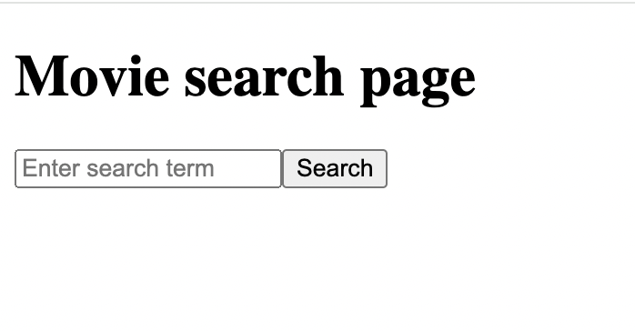
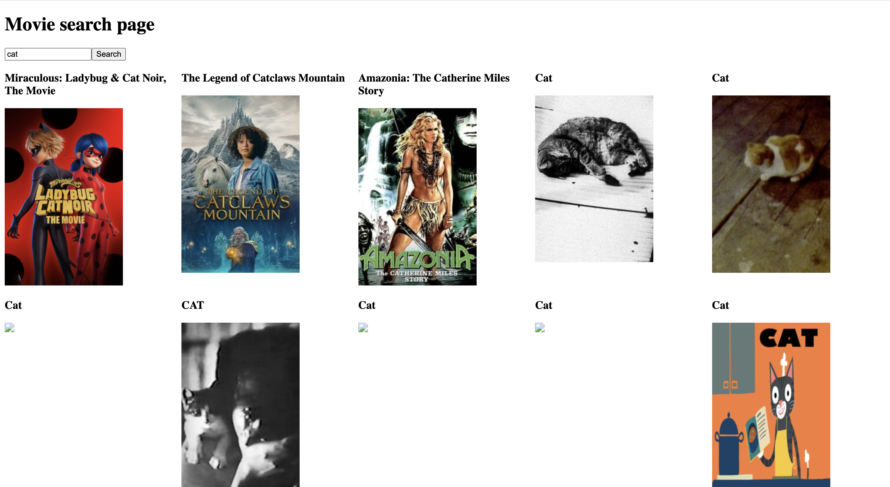

## Project Name & Pitch

This is a react practice challenge from reactpractice.dev: [reactpractice.dev exercise to create a movie search page](https://reactpractice.dev/exercise/create-a-movie-search-page/).

Create a page that allows users to search for movies.
It should consist of a search input box and a search button.
When the user clicks “Search”, the page should show the search results.

## Project Screen Shot(s)

## Installation and Setup Instructions

- `npm install`
- `npm start`
- Visit http://localhost:3000/

## Reflection

This was a React challenge focused on creating a custom hook for using API's. 
